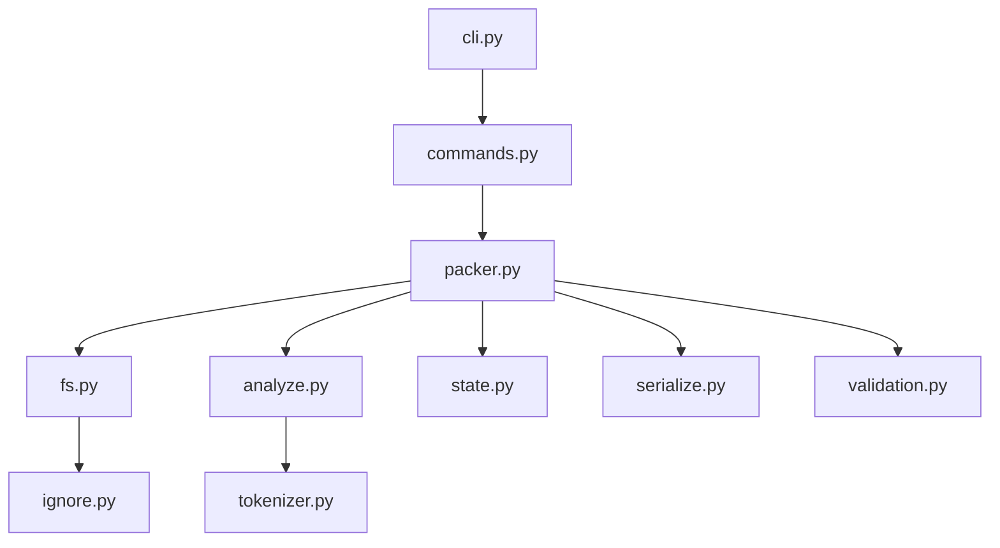
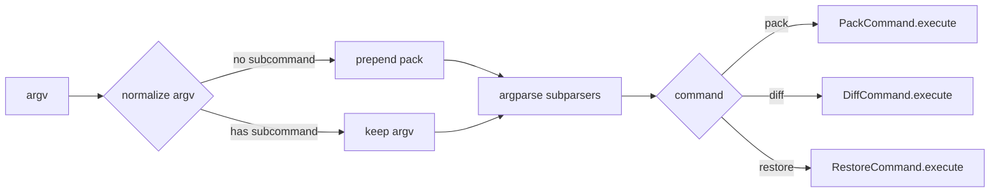
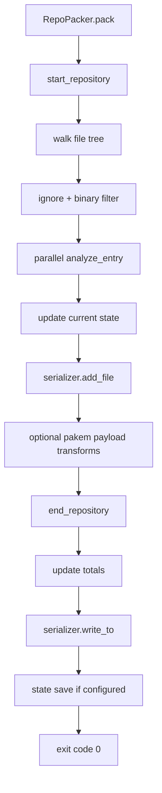
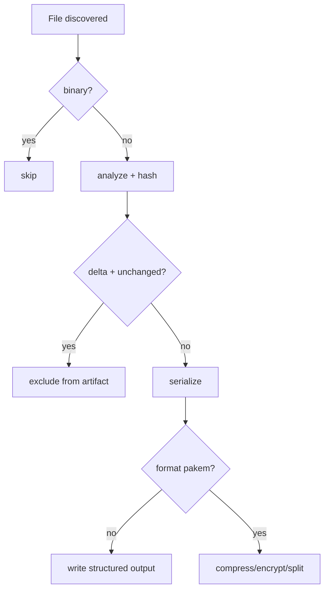
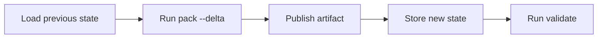

# pakem

`pakem` is a repository packaging system designed to convert source trees into portable artifacts for analysis, indexing, sharing, and restoration workflows.

It supports document-oriented outputs (`xml`, `json`, `proto`) and a binary archive format (`pakem`) with optional compression, reversible encryption, split output, incremental state tracking, and delta reporting.

---

## Table of Contents

1. [Mission and Scope](#mission-and-scope)
2. [Capability Matrix](#capability-matrix)
3. [System Architecture](#system-architecture)
4. [Data Flow and Control Flow](#data-flow-and-control-flow)
5. [Installation and Environment](#installation-and-environment)
6. [CLI Reference](#cli-reference)
7. [Output Formats and File Specifications](#output-formats-and-file-specifications)
8. [State, Delta, and Restore Semantics](#state-delta-and-restore-semantics)
9. [Security and Trust Model](#security-and-trust-model)
10. [Performance and Scalability Tuning](#performance-and-scalability-tuning)
11. [Validation and Quality Gates](#validation-and-quality-gates)
12. [Python API Usage](#python-api-usage)
13. [Operational Playbooks](#operational-playbooks)
14. [Troubleshooting](#troubleshooting)
15. [Module-by-Module Internals](#module-by-module-internals)
16. [Contributing and Release Workflow](#contributing-and-release-workflow)
17. [Glossary](#glossary)
18. [License](#license)

---

## Mission and Scope

`pakem` exists to solve one problem well:

- Scan a repository deterministically.
- Analyze textual source files.
- Serialize normalized metadata and content.
- Optionally track historical state for delta-oriented operations.
- Optionally emit a binary artifact that can be restored later.

### Primary Use Cases

| Use Case | Input | Output | Typical Consumer |
|---|---|---|---|
| LLM context packaging | Source repository | XML/JSON/Proto | Prompt pipelines, RAG preprocessors |
| Incremental repository snapshots | Source + state file | XML/JSON/Proto/Pakem + updated state | CI and scheduled jobs |
| Change-only artifact generation | Source + previous state + `--delta` | Delta subset + diff manifest | Review and sync automation |
| Archive and restore workflow | Source | `.pakem` (single or split) | Backup, transfer, migration |
| Ignore-rule diagnostics | Source + ignore patterns/files | Printed ignored list | Build engineering and DevEx |

---

## Capability Matrix

| Capability | xml | json | proto | pakem |
|---|---:|---:|---:|---:|
| Full repository metadata | Yes | Yes | Yes | Yes |
| File line-level content | Yes | Yes | Yes | Packed payload |
| Incremental state tracking (`--state`) | Yes | Yes | Yes | Yes |
| Delta mode (`--delta`) | Yes | Yes | Yes | Yes |
| Diff manifest output (`diff --diff-out`) | Yes | Yes | Yes | Yes |
| Optional compression (`--compress zlib`) | No | No | No | Yes |
| Optional reversible encryption (`--encrypt-key`) | No | No | No | Yes |
| Optional split output (`--split-size`) | No | No | No | Yes |
| Restore support (`restore`) | No | No | No | Yes |

---

## System Architecture

### High-Level Module Topology



### Command Dispatch Model



### Packing Execution Pipeline



---

## Data Flow and Control Flow

### Pack Command Data Contract

| Stage | Input | Output | Invariants |
|---|---|---|---|
| Argument resolution | CLI options | `Namespace` | Subcommand is one of `pack`, `diff`, `restore` |
| Output path resolution | `--out`, `--format` | concrete file path | If `--out` has no suffix, suffix is inferred by format |
| File walk | root + ignore rules | `FileEntry` stream | Relative paths normalized to `/` |
| Text analysis | file path | `FileMetadata` + content lines | Binary files are skipped |
| State update | previous state + file hash | current state | Each processed text file gets deterministic state entry |
| Serialization | metadata + lines | format artifact | Repository totals updated at end |

### Restore Command Data Contract

| Stage | Input | Output | Invariants |
|---|---|---|---|
| Artifact read | `.pakem` or split parts | bytes | Header must start with `PAKM` |
| Header parse | artifact bytes | metadata JSON + payload bytes | Version byte must be `1` |
| Chunk reconstruction | payload stream + per-file lengths | file bytes | Transform reversal is inverse of transform order |
| Write stage | `target_dir` + relative path | restored files | Path traversal outside target is rejected |

---

## Installation and Environment

### Minimal Installation

```bash
pip install pakem
```

### Development Installation

```bash
git clone https://github.com/YaronKoresh/pakem.git
cd pakem
pip install -e ".[dev]"
```

### Optional Extras

Install optional extras when needed:

```bash
pip install -e ".[extra]"
```

Extras currently include:

| Package | Enables |
|---|---|
| `pathspec` | Advanced gitignore-style pattern matching |
| `tiktoken` | Model-aware token counting |
| `protobuf` | Proto serializer support |

### Runtime Requirements

| Requirement | Value |
|---|---|
| Python | `>=3.10` |
| Project version | `1.0.0` |
| Entry point | `pakem = pakem.cli:main` |

---

## CLI Reference

## Global Invocation Forms

```bash
pakem <subcommand> [options]
python -m pakem <subcommand> [options]
```

If no subcommand is supplied, `pack` is implicitly used.

## `pack` Command

```bash
pakem pack [--path PATH] [--out OUT] [--format {xml,json,proto,pakem}]
```

### `pack` Options Table

| Option | Type | Default | Description |
|---|---|---|---|
| `--path` | string | `.` | Root directory to process |
| `--out` | string | `repo` | Output path or base name |
| `--ignore` | list[string] | none | Additional ignore patterns |
| `--ignore-file` | string | none | Path to extra ignore file |
| `--state` | string | none | JSON state file path |
| `--delta` | flag | `false` | Include only changed files |
| `--list-ignored` | flag | `false` | Print ignored entries and exit |
| `--model` | string | none | Tokenization model hint |
| `--workers` | int | auto | Analysis worker count |
| `--format` | enum | `xml` | Output format |
| `--emit-schema` | string | none | Schema output path |
| `--schema-format` | enum | `xml` | Schema format |
| `--compress` | enum | `none` | pakem payload compression |
| `--encrypt-key` | string | none | pakem reversible key |
| `--split-size` | int | none | pakem split threshold in bytes |

### `pack` Examples

```bash
# Default pack in current directory (implicit .xml suffix)
pakem pack

# Explicit format with auto extension
pakem pack --path ./repo --format json --out snapshot

# Delta pack using state file
pakem pack --path ./repo --state .pakem-state.json --delta --out delta-report

# pakem archive with payload transforms and splitting
pakem pack --path ./repo --format pakem --compress zlib --encrypt-key key123 --split-size 1048576 --out archive
```

## `diff` Command

```bash
pakem diff --state STATE [--path PATH] [--out OUT] [--diff-out FILE]
```

### `diff` Options Table

| Option | Type | Required | Description |
|---|---|---:|---|
| `--state` | string | Yes | Existing state file to compare against |
| `--path` | string | No | Root directory (default `.`) |
| `--out` | string | No | Artifact output base/path |
| `--diff-out` | string | No | JSON diff manifest output path |
| `--ignore` | list[string] | No | Additional ignore patterns |
| `--ignore-file` | string | No | Extra ignore file |
| `--format` | enum | No | Output format |

### `diff` Output Schema

If `--diff-out` is provided, JSON shape is:

```json
{
  "added": ["..."],
  "modified": ["..."],
  "removed": ["..."]
}
```

## `restore` Command

```bash
pakem restore --in ARCHIVE --target TARGET [--format pakem] [--compress {none,zlib}] [--encrypt-key KEY]
```

### `restore` Notes

- Supports `.pakem` artifacts and split sequences (`.pakem.part001`, `.part002`, ...).
- Uses metadata `payload_length` values to reconstruct file payload boundaries.
- Rejects writes that resolve outside `--target`.

---

## Output Formats and File Specifications

## Extension Auto-Selection

When `--out` has no suffix:

| Format | Applied Suffix |
|---|---|
| `xml` | `.xml` |
| `json` | `.json` |
| `proto` | `.pb` |
| `pakem` | `.pakem` |

If `--out` already has a suffix, it is preserved.

## XML and JSON

Both represent repository metadata, directory records, and file records. XML uses nested elements, JSON uses structured objects.

## Protobuf

Protobuf uses dynamic message generation from `pakem.proto` descriptor construction at runtime.

## pakem Binary Container

### Binary Layout

| Segment | Size | Description |
|---|---:|---|
| Magic | 4 bytes | ASCII `PAKM` |
| Version | 1 byte | Current value: `1` |
| Header length | 4 bytes (big-endian) | Byte length of metadata JSON |
| Metadata | variable | UTF-8 JSON with repository/file descriptors |
| Payload | variable | Concatenated file payload chunks |

### Metadata Core Keys

| Key | Type | Description |
|---|---|---|
| `repository` | object | Root metadata, totals, timestamp |
| `directories` | array | Optional directory entries |
| `files` | array | File descriptors including `payload_length` |
| `payload_size` | int | Total payload bytes |

### Split Output Behavior

If final blob size exceeds `--split-size`, writer emits:

- `name.pakem.part001`
- `name.pakem.part002`
- ...

No root `.pakem` file is emitted in split mode.

---

## State, Delta, and Restore Semantics

## State Model

State file stores:

| Field | Type | Description |
|---|---|---|
| `version` | int | Schema version, current default is `2` |
| `files` | object map | `rel_path -> {mtime, size, sha256}` |

Legacy state without `version` loads as version `1`.

## Delta Computation

`RepoState.diff_paths(new_state)` returns sorted path lists for:

- `added`
- `modified`
- `removed`

In delta mode:

- unchanged files are not serialized into output payload
- serializer repository metadata can include a `delta` block

## Restore Semantics

Restore requires `pakem` format and follows this inversion logic:

1. Parse header and metadata.
2. Slice payload by `payload_length` per file.
3. Reverse encryption (if key supplied).
4. Reverse compression (`zlib`) if enabled.
5. Validate target path safety.
6. Write file bytes.

---

## Security and Trust Model

## Current Security Controls

| Control | Status | Description |
|---|---|---|
| Path traversal prevention | Enabled | Restore checks target path boundaries via realpath/commonpath logic |
| Format sanity checks | Enabled | `validate_pakem` checks magic/version/header consistency |
| Binary detection | Enabled | Binary files skipped during source pack stage |

## Important Cryptography Note

Current `--encrypt-key` implementation uses a reversible XOR stream transformation for payload obfuscation and deterministic reversibility.

This is not a modern authenticated encryption scheme.

Use it only where lightweight reversible transformation is acceptable, and prefer transport/storage controls for strong security requirements.

---

## Performance and Scalability Tuning

## Worker Strategy

By default, worker count is derived from CPU count (`cpu_count * 4` minimum 1).

Guidance:

| Repository profile | Suggested `--workers` |
|---|---:|
| Small (<5k files) | auto |
| Medium (5k-50k files) | 8-16 |
| Large monorepo | 16-32 (validate host IO limits) |

## Throughput Considerations

| Factor | Impact |
|---|---|
| Binary file prevalence | More binaries means faster total run due to skip behavior |
| Tokenizer backend | `tiktoken` can improve model parity; regex fallback avoids dependency |
| State availability | Existing state can reduce expensive hash recompute paths |
| Pakem transforms | Compression and encryption increase CPU load |

## Flowchart: Performance Path



---

## Validation and Quality Gates

## Built-in Validators

| Validator | Target |
|---|---|
| `validate_xml(path)` | XML artifacts |
| `validate_json(path)` | JSON artifacts |
| `validate_proto(path)` | Proto artifacts |
| `validate_pakem(path)` | pakem binary artifacts |
| `validate(path, format=None)` | Format inference + dispatch |

## Project Quality Commands

| Goal | Command |
|---|---|
| Run tests | `pytest -q` |
| Run linter | `ruff check .` |
| Compile check | `python -m compileall -q .` |
| All checks (poe) | `poe check` |

---

## Python API Usage

## Basic Pack

```python
from pakem import IgnoreRules, RepoPacker
from pakem.fs import FileWalker

root = "/path/to/repo"
out = "repo.xml"

rules = IgnoreRules.from_defaults(root, extra_patterns=["*.tmp"])
walker = FileWalker(root, rules, output_path=out)

packer = RepoPacker(
    root_dir=root,
    output_file=out,
    ignore_rules=rules,
    walker=walker,
    output_format="xml",
)

exit_code = packer.pack()
print(exit_code)
```

## Advanced Pack (pakem)

```python
from pakem import IgnoreRules, RepoPacker
from pakem.fs import FileWalker

root = "/path/to/repo"
out = "archive.pakem"

rules = IgnoreRules.from_defaults(root)
walker = FileWalker(root, rules, output_path=out)

packer = RepoPacker(
    root_dir=root,
    output_file=out,
    ignore_rules=rules,
    walker=walker,
    state_path=".pakem-state.json",
    delta=True,
    output_format="pakem",
    compression="zlib",
    encryption_key="demo-key",
    split_size=2_000_000,
)

packer.pack()
```

## Restore via API

```python
from pakem import IgnoreRules, RepoPacker
from pakem.fs import FileWalker

target = "./restored"
rules = IgnoreRules.from_defaults(target)

packer = RepoPacker(
    root_dir=target,
    output_file="archive.pakem",
    ignore_rules=rules,
    walker=FileWalker(target, rules),
    output_format="pakem",
    compression="zlib",
    encryption_key="demo-key",
)

packer.restore("archive.pakem", target)
```

---

## Operational Playbooks

## Playbook A: Daily Incremental Snapshot



Steps:

1. Keep a persistent state file per repository.
2. Run `pakem pack --state state.json --delta`.
3. Store resulting artifact and updated state file together.
4. Optionally run `pakem diff --state state.json --diff-out diff.json` for change reports.

## Playbook B: Transfer as Split Binary

1. `pakem pack --format pakem --split-size 1048576 --out archive`
2. Transfer all `.partNNN` files.
3. Restore with:
   `pakem restore --in archive.pakem --target ./target`

## Playbook C: Ignore Rules Debug Session

1. Add new patterns via `--ignore` or `--ignore-file`.
2. Execute `pakem pack --list-ignored --path ...`.
3. Validate expected paths appear in output list.

---

## Troubleshooting

| Symptom | Likely Cause | Corrective Action |
|---|---|---|
| `restore` returns `1` with no files | Wrong format or invalid magic/header | Verify archive starts with `PAKM`, run `validate_pakem` |
| Missing expected files in output | Ignore rules filtering them | Use `--list-ignored` and adjust patterns |
| Output extension not what you expected | `--out` had explicit suffix | Remove suffix from `--out` to use auto-extension |
| Token counts seem generic | `tiktoken` not installed or model unsupported | Install extras and pass `--model` |
| Delta output too large | State file missing or stale | Keep state persisted and scoped per repository |
| Split archive not restoring | Part files missing/out of order | Ensure contiguous `.partNNN` files are present |

### Diagnostic Commands

```bash
# Check lints and imports
ruff check .

# Verify runtime behavior
pytest -q

# Validate artifact (Python snippet)
python -c "from pakem.validation import validate; validate('archive.pakem', 'pakem')"
```

---

## Module-by-Module Internals

| Module | Responsibility | Key Types/Functions |
|---|---|---|
| `pakem/cli.py` | Argument parsing and subcommand routing | `main`, `resolve_output_path` |
| `pakem/commands.py` | Command execution adapters | `PackCommand`, `DiffCommand`, `RestoreCommand` |
| `pakem/packer.py` | Core orchestration pipeline | `RepoPacker.pack`, `RepoPacker.diff`, `RepoPacker.restore` |
| `pakem/fs.py` | Deterministic file traversal | `FileWalker`, `FileEntry` |
| `pakem/ignore.py` | Ignore pattern loading and matching | `IgnoreRules` |
| `pakem/analyze.py` | Metadata extraction and token/line counting | `FileMetadata`, `analyze_text` |
| `pakem/tokenizer.py` | Token counting backends | `RegexTokenCounter`, `TiktokenTokenCounter` |
| `pakem/state.py` | Incremental file state and diffs | `RepoState`, `FileState`, `diff_paths` |
| `pakem/serialize.py` | XML/JSON/Proto/Pakem serializers | `XmlSerializer`, `JsonSerializer`, `ProtoSerializer`, `PakemSerializer` |
| `pakem/validation.py` | Artifact validation and path safety | `validate`, `validate_pakem`, `is_path_safe` |
| `pakem/proto.py` | Dynamic protobuf schema descriptor | `get_repository_message_class` |

---

## Contributing and Release Workflow

## Development Workflow

```bash
pip install -e ".[dev,extra]"
ruff check .
pytest -q
```

## Suggested Pull Request Checklist

| Check | Status |
|---|---|
| New behavior covered by tests | Required |
| Lint passes (`ruff check .`) | Required |
| README updated for CLI/API changes | Required |
| Backward compatibility considered | Recommended |
| State/format migrations documented | Recommended |

## Packaging Tasks

| Task | Command |
|---|---|
| Build source + wheel | `poe build` |
| Build wheel only | `poe build-wheel` |
| Install pre-commit hooks | `poe hook` |

---

## Glossary

| Term | Meaning |
|---|---|
| Artifact | Final output file(s) produced by a run |
| Delta mode | Serialization of only changed files relative to previous state |
| State file | JSON map of file path to mtime/size/hash used for incremental processing |
| Payload length | Byte length of one file's serialized bytes inside pakem payload stream |
| Split archive | Multi-part output generated when blob exceeds `--split-size` |

---

## License

This project is licensed under the GNU General Public License v3.0 or later.

See [LICENSE](LICENSE) for full terms.
